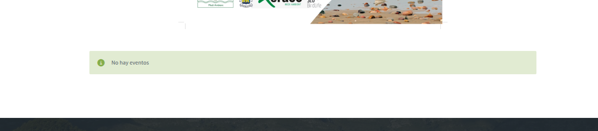
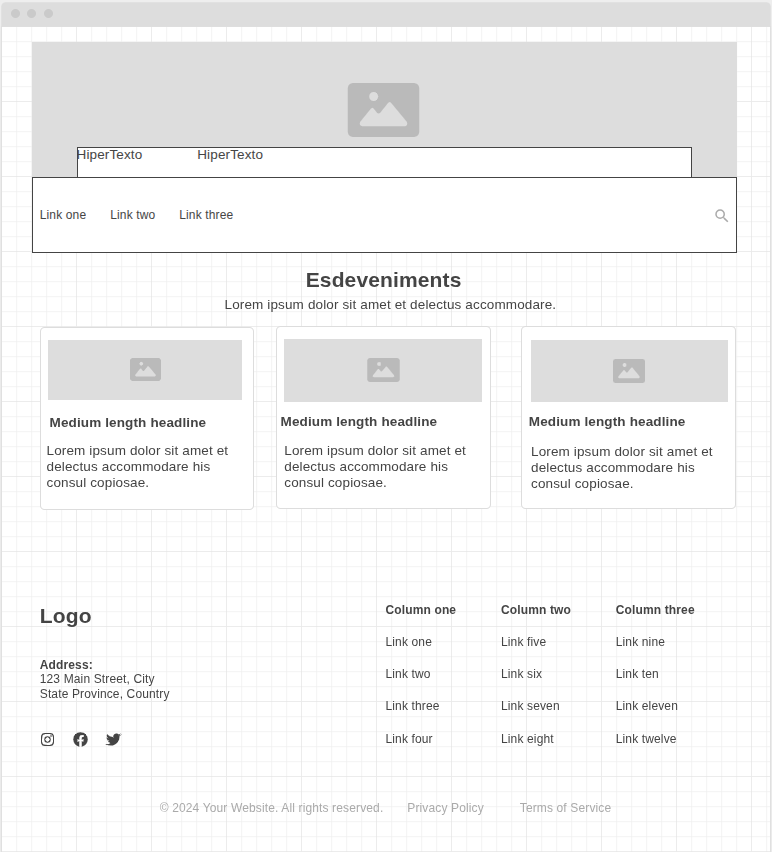
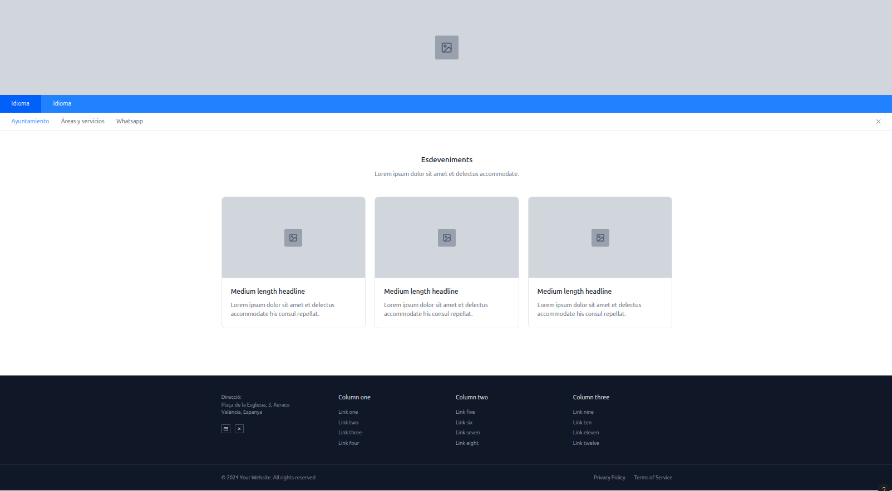

# Dossier

## Integrants

* David Camarena
* Eliseu Martínez

## Proposta

La pàgina web de Xeraco <xeraco.eu> li falta un aparatat d'esdeveniment culturals funcional.

Sembla que hi ha hagut algun intent d'incorporar-la sense èxit. Un apartat orfe que diu: **No hay eventos**

Es proposa generar una pàgina dedicada a publicar esdeveniments locals festius i culturals d'interés popular.

Per aconseguir-ho es dissenyarà una pàgina amb components de tipus targeta clicables que redirigeixen a un post del blog on es descriu l'esdeveniment.

A la pàgina d'esdeveniments s'accedeix mitjançant un click a la barra del navegador.

## Procés de disseny

### Wireframe

S'ha utilitzat la ferramenta <wireframe.cc>

### Mockup

S'ha utilitzat la ferramenta <app.mockflow.com>

### Prototip

S'ha utilitzat la ferramenta Figma <figma.com>

